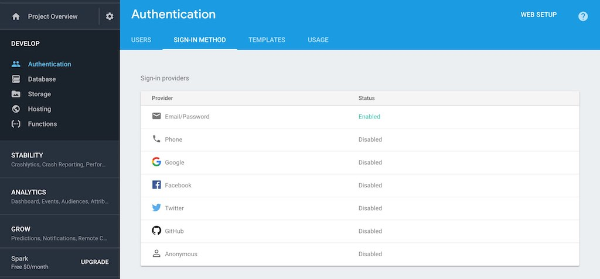
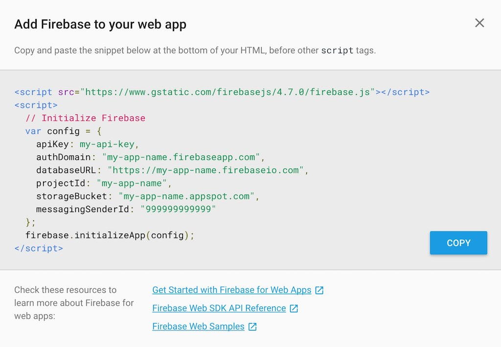

## Firebase Authentication in React

TODO: Write introdcution to this larger section.

## Firebase in React Setup

It's time to sign up for an account on the [Firebase website](https://firebase.google.com/). After you have created an account, you should be able to create a new project that will be used for your application on their platform. You can give your project any name. Furthermore, you can run it on the free plan.

Once your project is created on their website, you should have a dashboard for it. There you can find a menu item which says "Authentication". Select it, and click the "Sign-In Method" menu item afterward. There you can enable the Email/Password authentication method. This tutorial will cover the basic authentication with email and password, but feel free to add other authentication methods later on. If you do so and open source your project, you can link it in the comments below for other readers of this guide.

Next, you need to find your configuration in the project settings on your dashboard. There you have access to all the necessary information: secrets, keys, ids and other properties. You will copy these in the next step to your React application.

The Firebase website doesn't make it easy to find this page. Since it's moved around with every iteration of the website, I cannot give you any clear advice where to find it on your dashboard. But it is there, somewhere! Take it as an opportunity to get to know your Firebase project dashboard while searching for this mysterious configuration. :)

That's it for the Firebase website setup. Now you can return to your application in your editor to add the Firebase configuration. So, create a couple of files in a new dedicated Firebase folder.

{title="Command Line: src/",lang="text"}
~~~~~~~~
mkdir firebase
cd firebase
touch index.js firebase.js auth.js
~~~~~~~~

So what's the deal with all those files? Here comes an overview from top to bottom:

* **index.js:** It's a simple entry point file to the Firebase module (*src/firebase/* folder) by grouping and exposing all the functionalities from the module to other modules in one file. Thus it shouldn't be necessary for other modules in your application to access any other file than this one to use its functionalities.

* **firebase.js:** The file where all the configuration goes that you have seen previously on your Firebase dashboard. In addition, Firebase itself will be instantiated in this file.

* **auth.js:** The file where the Firebase authentication API will be defined to sign up, sign in, sign out etc. a user in your application. It is the interface between the official Firebase API and your React application.

Let's start with the configuration. First, copy the configuration from your Firebase dashboard on their website to your application in a configuration object. Make sure to replace the capitalized keys with the corresponding keys from your own copied configuration.

{title="src/firebase/firebase.js",lang=javascript}
~~~~~~~~
const config = {
  apiKey: YOUR_API_KEY,
  authDomain: YOUR_AUTH_DOMAIN,
  databaseURL: YOUR_DATABASE_URL,
  projectId: YOUR_PROJECT_ID,
  storageBucket: '',
  messagingSenderId: YOUR_MESSAGING_SENDER_ID,
};
~~~~~~~~

Second, import the firebase object from the firebase node package which you have already installed in the very beginning of this tutorial. Afterward, initialize it, if it isn't already initialized, with the configuration object.

{title="src/firebase/firebase.js",lang=javascript}
~~~~~~~~
# leanpub-start-insert
import * as firebase from 'firebase';
# leanpub-end-insert

const config = {
  apiKey: YOUR_API_KEY,
  authDomain: YOUR_AUTH_DOMAIN,
  databaseURL: YOUR_DATABASE_URL,
  projectId: YOUR_PROJECT_ID,
  storageBucket: '',
  messagingSenderId: YOUR_MESSAGING_SENDER_ID,
};

# leanpub-start-insert
if (!firebase.apps.length) {
  firebase.initializeApp(config);
}
# leanpub-end-insert
~~~~~~~~

Third, initialize the auth object. That's the part of the Firebase API which will be used in the *src/firebase/auth.js* file and thus needs to be exported. In a later part of this tutorial, you will initialize the database object the same way too. But for now, the auth object will be sufficient.

{title="src/firebase/firebase.js",lang=javascript}
~~~~~~~~
import * as firebase from 'firebase';

const config = {
  apiKey: YOUR_API_KEY,
  authDomain: YOUR_AUTH_DOMAIN,
  databaseURL: YOUR_DATABASE_URL,
  projectId: YOUR_PROJECT_ID,
  storageBucket: '',
  messagingSenderId: YOUR_MESSAGING_SENDER_ID,
};

if (!firebase.apps.length) {
  firebase.initializeApp(config);
}

# leanpub-start-insert
const auth = firebase.auth();

export {
  auth,
};
# leanpub-end-insert
~~~~~~~~

That's it for the configuration part. There is one last optional step. On the Firebase website, you could create a second project. Afterward, your first project could be used as your development database and your second project as your production database. That way, you never mix up your data from development mode with your data from your deployed application (production mode). The step is optional.

{title="src/firebase/firebase.js",lang=javascript}
~~~~~~~~
import * as firebase from 'firebase';

# leanpub-start-insert
const prodConfig = {
  apiKey: YOUR_API_KEY,
  authDomain: YOUR_AUTH_DOMAIN,
  databaseURL: YOUR_DATABASE_URL,
  projectId: YOUR_PROJECT_ID,
  storageBucket: '',
  messagingSenderId: YOUR_MESSAGING_SENDER_ID,
};
# leanpub-end-insert

# leanpub-start-insert
const devConfig = {
# leanpub-end-insert
  apiKey: YOUR_API_KEY,
  authDomain: YOUR_AUTH_DOMAIN,
  databaseURL: YOUR_DATABASE_URL,
  projectId: YOUR_PROJECT_ID,
  storageBucket: '',
  messagingSenderId: YOUR_MESSAGING_SENDER_ID,
};

# leanpub-start-insert
const config = process.env.NODE_ENV === 'production'
  ? prodConfig
  : devConfig;
# leanpub-end-insert

if (!firebase.apps.length) {
  firebase.initializeApp(config);
}

const auth = firebase.auth();

export {
  auth,
};
~~~~~~~~

Great! You have initialized Firebase in your application. In the next part, you will define the interface for the Firebase API which will be consumed by your React components.

## Firebase's Authentication API

In the previous section, you have created a Firebase project on the official Firebase website and enabled the authentication with email and password. Now you will implement the authentication API. You can read up on all functionalities that are exposed by the API in the official Firebase documentation.

Initially, import the previously instantiated auth object from the Firebase configuration file.

{title="src/firebase/auth.js",lang=javascript}
~~~~~~~~
import { auth } from './firebase';
~~~~~~~~

Now, let's define all the authentication functions step by step. First, the sign-up function. It takes email and password parameters in its function signature and uses an official Firebase endpoint from the firebase object to create a user.

{title="src/firebase/auth.js",lang=javascript}
~~~~~~~~
import { auth } from './firebase';

# leanpub-start-insert
// Sign Up
export const doCreateUserWithEmailAndPassword = (email, password) =>
  auth.createUserWithEmailAndPassword(email, password);
# leanpub-end-insert
~~~~~~~~

Second, the sign-in function which takes email and password parameters, as well. It also uses a Firebase endpoint to sign in a user.

{title="src/firebase/auth.js",lang=javascript}
~~~~~~~~
import { auth } from './firebase';

// Sign Up
export const doCreateUserWithEmailAndPassword = (email, password) =>
  auth.createUserWithEmailAndPassword(email, password);

# leanpub-start-insert
// Sign In
export const doSignInWithEmailAndPassword = (email, password) =>
  auth.signInWithEmailAndPassword(email, password);
# leanpub-end-insert
~~~~~~~~

At this point, note that these endpoints are called asynchronously. They need to be resolved later on. In addition, there needs to be error handling for it. For instance, it is not possible to sign in a user who is not signed up yet. The Firebase API would return an error. You will implement all of this in a later part of this tutorial.

Third, the sign-out function. You don't need to pass any argument to it, because the auth object itself knows about the currently authenticated user (if a user is authenticated in the first place).

{title="src/firebase/auth.js",lang=javascript}
~~~~~~~~
import { auth } from './firebase';

// Sign Up
export const doCreateUserWithEmailAndPassword = (email, password) =>
  auth.createUserWithEmailAndPassword(email, password);

// Sign In
export const doSignInWithEmailAndPassword = (email, password) =>
  auth.signInWithEmailAndPassword(email, password);

# leanpub-start-insert
// Sign out
export const doSignOut = () =>
  auth.signOut();
# leanpub-end-insert
~~~~~~~~

Last, but not least, the two optional functions to reset and change a password of an authenticated user.

{title="src/firebase/auth.js",lang=javascript}
~~~~~~~~
import { auth } from './firebase';

...

# leanpub-start-insert
// Password Reset
export const doPasswordReset = (email) =>
  auth.sendPasswordResetEmail(email);

// Password Change
export const doPasswordUpdate = (password) =>
  auth.currentUser.updatePassword(password);
# leanpub-end-insert
~~~~~~~~

That's it for the whole authentication interface for your React components to be connected to the Firebase API. It covers all the use cases for the purpose of this tutorial. Finally, you should expose the implemented authentication methods and the Firebase functionalities itself form your Firebase module.

{title="src/firebase/index.js",lang=javascript}
~~~~~~~~
import * as auth from './auth';
import * as firebase from './firebase';

export {
  auth,
  firebase,
};
~~~~~~~~

That way, consumers (React components in our case) should be only allowed to access the *index.js* file as interface to the whole Firebase module (*src/firebase/*) and should not access the auth or firebase files directly.

## Sign Up with React and Firebase

In the previous sections, you have set up all the routes for your application, configured Firebase and implemented the authentication API. Now it is about time to use the authentication functionalities in your React components. Let's build the components from scratch. I try to put most of the code in one block at this point, because the components are not too small and splitting it up step by step could be too verbose. Nevertheless, I will guide you through each code block afterward. At some point, the code blocks for forms can become repetitive. Thus they will be explained once well enough in the beginning, but later in a similar version reused.

Let's start with the sign up page. It consists of the page, a form, and a link. Whereas the form is used to sign up a new user to your application, the link will be used later on the sign in page when a user has no account yet. It is only a redirect to the sign up page, but not used on the sign up page itself. Still, it shares the same domain and therefore shares the same file as the sign up page and sign up form.

{title="src/components/SignUp.js",lang=javascript}
~~~~~~~~
import React, { Component } from 'react';
import { Link } from 'react-router-dom';

import * as routes from '../constants/routes';

const SignUpPage = () =>
  

    <h1>SignUp</h1>
    <SignUpForm />
  

class SignUpForm extends Component {
  constructor(props) {
    super(props);
  }

  onSubmit = (event) => {

  }

  render() {
    return (
      <form onSubmit={this.onSubmit}>

      </form>
    );
  }
}

const SignUpLink = () =>
  

    Don't have an account?
    {' '}
    <Link to={routes.SIGN_UP}>Sign Up</Link>
  

export default SignUpPage;

export {
  SignUpForm,
  SignUpLink,
};
~~~~~~~~

In the next step, let's focus on the SignUpForm component. It is the only React ES6 class component in the file, because it has to manage the form state in React's local state. There are two pieces missing in the current SignUpForm component: the form content in terms of input fields to capture the information (email address, password, etc.) and the implementation of the onSubmit class method when a user signs up eventually.

First, let's initialize the state of the component. It will capture the user information such as username, email, and password. There will be two password fields for a password confirmation step. In addition, there is an error state to capture an error object in case of the sign up request to the Firebase API fails. The state is initialized by an object destructuring.

{title="src/components/SignUp.js",lang=javascript}
~~~~~~~~
...

# leanpub-start-insert
const INITIAL_STATE = {
  username: '',
  email: '',
  passwordOne: '',
  passwordTwo: '',
  error: null,
};
# leanpub-end-insert

class SignUpForm extends Component {
  constructor(props) {
    super(props);

# leanpub-start-insert
    this.state = { ...INITIAL_STATE };
# leanpub-end-insert
  }

  ...

}

...
~~~~~~~~

Second, let's implement all the input fields to capture those information in the render method of the component. The input fields need to update the local state of the component by using their onChange handler.

{title="src/components/SignUp.js",lang=javascript}
~~~~~~~~
...

# leanpub-start-insert
const byPropKey = (propertyName, value) => () => ({
  [propertyName]: value,
});
# leanpub-end-insert

class SignUpForm extends Component {

  ...

  render() {
    const {
      username,
      email,
      passwordOne,
      passwordTwo,
      error,
    } = this.state;

    return (
      <form onSubmit={this.onSubmit}>
# leanpub-start-insert
        <input
          value={username}
          onChange={event => this.setState(byPropKey('username', event.target.value))}
          type="text"
          placeholder="Full Name"
        />
        <input
          value={email}
          onChange={event => this.setState(byPropKey('email', event.target.value))}
          type="text"
          placeholder="Email Address"
        />
        <input
          value={passwordOne}
          onChange={event => this.setState(byPropKey('passwordOne', event.target.value))}
          type="password"
          placeholder="Password"
        />
        <input
          value={passwordTwo}
          onChange={event => this.setState(byPropKey('passwordTwo', event.target.value))}
          type="password"
          placeholder="Confirm Password"
        />
        <button type="submit">
          Sign Up
        </button>

        { error && 
{error.message}
 }
# leanpub-end-insert
      </form>
    );
  }
}

...
~~~~~~~~

Let's take the last implemented code block apart. All the input fields implement the unidirectional data flow of React. Thus each input field gets a value from the local state and updates the value in the local state with a `onChange` handler. The input fields are controlled by the local state of the component and don't control their own states (controlled components).

Let's take a look at the abstracted function which is used in the `setState()` method. It is a higher order function which takes a key value and the actual value that is typed into the input field. In the `byPropKey()` function, the key value is used as [dynamic key](https://developer.mozilla.org/en-US/docs/Web/JavaScript/Reference/Operators/Object_initializer) to allocate the actual value in the local state object. That's it for the whole update mechanism to handle all the input fields in the form.

In the last part of the form, there is an optional error message that is used from an error object. These error objects from Firebase have this message property by nature, so you can rely on it to display a proper text for your application user. However, the message is only shown when there is an error by using a [conditional rendering](https://www.robinwieruch.de/conditional-rendering-react/).

One piece in the form is missing: validation. Let's use a `isInvalid` boolean to enable or disable the submit button. When you think about a validation condition for the form, what would it be? It is shown in the next code snippet.

{title="src/components/SignUp.js",lang=javascript}
~~~~~~~~
...

class SignUpForm extends Component {

  ...

  render() {
    const {
      username,
      email,
      passwordOne,
      passwordTwo,
      error,
    } = this.state;

# leanpub-start-insert
    const isInvalid =
      passwordOne !== passwordTwo ||
      passwordOne === '' ||
      email === '' ||
      username === '';
# leanpub-end-insert

    return (
      <form onSubmit={this.onSubmit}>
        <input
        ...
# leanpub-start-insert
        <button disabled={isInvalid} type="submit">
# leanpub-end-insert
          Sign Up
        </button>

        { error && 
{error.message}
 }
      </form>
    );
  }
}

...
~~~~~~~~

Of course, the user is only allowed to sign up if both passwords are the same (part of the password confirmation in a common sign up process) and if the username, email and at least one password are filled with a string. You should be able to visit the */signup* route in your browser after starting your application to confirm that the form with all its input fields shows up. Furthermore, you should be able to type into it (confirmation that the local state updates are working) and you should be able to enable the submit button by providing all input fields a string (confirmation that the validation works). What's missing in the component is the `onSubmit()` class method which will pass all the form data to the Firebase authentication API via your previously set authentication interface in the firebase folder.

{title="src/components/SignUp.js",lang=javascript}
~~~~~~~~
...
# leanpub-start-insert
import { auth } from '../firebase';
# leanpub-end-insert
import * as routes from '../constants/routes';

...

class SignUpForm extends Component {

  ...

  onSubmit = (event) => {
# leanpub-start-insert
    const {
      username,
      email,
      passwordOne,
    } = this.state;

    auth.doCreateUserWithEmailAndPassword(email, passwordOne)
      .then(authUser => {
        this.setState(() => ({ ...INITIAL_STATE }));
      })
      .catch(error => {
        this.setState(byPropKey('error', error));
      });

    event.preventDefault();
# leanpub-end-insert
  }

  ...
}

...
~~~~~~~~

Let's break down what happens in the previous code block. All the necessary information that is passed to the authentication API can be destructured from the local state. You will only need one password property, because both password strings should be the same after the validation anyway.

Next, you can call the sign up function which you have defined in the previous section. It takes the email and the password properties. The username is not used yet, but will be in a later section of this tutorial. It's up to you to remove it for now as well if you want to get rid of the noisy "unused variable" warning on the command line.

If the request resolves successfully, you can set the local state of the component to its initial state to empty the input fields. If the request is rejected, you will run into the catch block and set the error object in the local state. Thus an error message should show up in the form.

In addition, the `preventDefault()` method on the event prevents a reload of the browser which otherwise would be a natural behavior when using a submit in a form. Moreover, note that the signed up user object from the Firebase API is available in the callback function of the then block in our request. You will use it later on in this tutorial.

If you want to read more about asynchronous requests in React components, checkout [this article which explains the concept in more detail by fetching data from a third-party API](https://www.robinwieruch.de/react-fetching-data/).

So what's next? When a user signs up to your application, you want to redirect the user to another page. Perhaps it should be the Home page of the user which will be a protected route for only authenticated users at some point of this tutorial. Therefore, you will need the help of React Router to redirect the user after a successful sign up.

{title="src/components/SignUp.js",lang=javascript}
~~~~~~~~
import React, { Component } from 'react';
import {
  Link,
# leanpub-start-insert
  withRouter,
# leanpub-end-insert
} from 'react-router-dom';

import { auth } from '../firebase';
import * as routes from '../constants/routes';

# leanpub-start-insert
const SignUpPage = ({ history }) =>
# leanpub-end-insert
  

    <h1>SignUp</h1>
# leanpub-start-insert
    <SignUpForm history={history} />
# leanpub-end-insert
  

...

class SignUpForm extends Component {

  ...

  onSubmit = (event) => {
    const {
      username,
      email,
      passwordOne,
    } = this.state;

# leanpub-start-insert
    const {
      history,
    } = this.props;
# leanpub-end-insert

    auth.doCreateUserWithEmailAndPassword(email, passwordOne)
      .then(authUser => {
        this.setState(() => ({ ...INITIAL_STATE }));
# leanpub-start-insert
        history.push(routes.HOME);
# leanpub-end-insert
      })
      .catch(error => {
        this.setState(byPropKey('error', error));
      });

    event.preventDefault();
  }

  ...
}

...

# leanpub-start-insert
export default withRouter(SignUpPage);
# leanpub-end-insert

export {
  SignUpForm,
  SignUpLink,
};
~~~~~~~~

Let's take the previous code block apart again. In order to redirect a user to another page programmatically, we need access to React Router. Somehow it needs to be possible to tell React Router that it should redirect the user to another page. Fortunately, the React Router node package offers a neat higher order component](https://www.robinwieruch.de/gentle-introduction-higher-order-components/) to make the router properties accessible in the props of a component. Any component which goes in the `withRouter()` higher order component gets access to all the properties of the router. Thus when passing the SignUpPage component to the `withRouter()` higher order component, it has in its own function signature access to the props of the React Router. The relevant property for us from the router props is the `history` object. That's the part which enables us to redirect a user to another page. It can be used to push routes to it for these redirects. That's why the history is passed down to the SignUpForm component.

Just in case: There is no particular reason why I wrapped the SignUpPage and not the SignUpForm with the higher order component.

Eventually, the history object of the router can be used in the `onSubmit()` class method. If a request resolves successfully, you can push any route to the history object. Since the pushed route is defined in our App component with a corresponding component, the displayed page component will change after the redirect.

You can run your application now and checkout if the sign up process works for you. If you signed up a user successfully, you should be redirected to the home page. If the sign up fails, you should see an error message. Try to sign up a user with the same email address twice and verify that the following or a similar error message shows up: "The email address is already in use by another account.". Congratulations, you signed up your first user via Firebase authentication.

## Sign In with React and Firebase

A sign up automatically results into a sign in of a user. That's something you will notice later on eventually. However, of course, we cannot rely on it, because a user could already be signed up but not signed in to your application.

Let's implement the sign in now. It is similar to the sign up mechanism and components, so this time I will not split up any code blocks. It's straight forward if you went through the previous sign up form.

{title="src/components/SignIn.js",lang=javascript}
~~~~~~~~
import React, { Component } from 'react';
import { withRouter } from 'react-router-dom';

import { SignUpLink } from './SignUp';
import { auth } from '../firebase';
import * as routes from '../constants/routes';

const SignInPage = ({ history }) =>
  

    <h1>SignIn</h1>
    <SignInForm history={history} />
    <SignUpLink />
  

const byPropKey = (propertyName, value) => () => ({
  [propertyName]: value,
});

const INITIAL_STATE = {
  email: '',
  password: '',
  error: null,
};

class SignInForm extends Component {
  constructor(props) {
    super(props);

    this.state = { ...INITIAL_STATE };
  }

  onSubmit = (event) => {
    const {
      email,
      password,
    } = this.state;

    const {
      history,
    } = this.props;

    auth.doSignInWithEmailAndPassword(email, password)
      .then(() => {
        this.setState(() => ({ ...INITIAL_STATE }));
        history.push(routes.HOME);
      })
      .catch(error => {
        this.setState(byPropKey('error', error));
      });

    event.preventDefault();
  }

  render() {
    const {
      email,
      password,
      error,
    } = this.state;

    const isInvalid =
      password === '' ||
      email === '';

    return (
      <form onSubmit={this.onSubmit}>
        <input
          value={email}
          onChange={event => this.setState(byPropKey('email', event.target.value))}
          type="text"
          placeholder="Email Address"
        />
        <input
          value={password}
          onChange={event => this.setState(byPropKey('password', event.target.value))}
          type="password"
          placeholder="Password"
        />
        <button disabled={isInvalid} type="submit">
          Sign In
        </button>

        { error && 
{error.message}
 }
      </form>
    );
  }
}

export default withRouter(SignInPage);

export {
  SignInForm,
};
~~~~~~~~

Basically, it is almost the same as the sign up form. The form with its input fields captures all the necessary information such as username and password. A validation step makes sure that email and password are set before performing the request by enabling or disabling the submit button. The authentication API is used again, but this time with the function to sign in a user rather than the function to sign up a user. If the sign in succeeds, the local state is updated with the initial state and the user is redirected again. If the sign in fails, an error object is stored in the local state and an error messages should show up. There is one difference though: The SignUpLink which you have defined in the previous section is used on the sign in page. It gives the user an alternative way in case the person isn't signed up yet but happens to be on the sign in page.

## Sign Out with React and Firebase

In order to complete the authentication loop, let's implement as last part the sign out component. It doesn't need any form and is only a button which shows up in the Navigation component in the next steps. Since we can use the already defined authentication API to sign out a user, it is fairly straight forward to pass the functionality to a button in a React component.

{title="src/components/SignOut.js",lang=javascript}
~~~~~~~~
import React from 'react';

import { auth } from '../firebase';

const SignOutButton = () =>
  <button
    type="button"
    onClick={auth.doSignOut}
  >
    Sign Out
  </button>

export default SignOutButton;
~~~~~~~~

The button can be used in the Navigation component now.

{title="src/components/Navigation.js",lang=javascript}
~~~~~~~~
import React from 'react';
import { Link } from 'react-router-dom';

# leanpub-start-insert
import SignOutButton from './SignOut';
# leanpub-end-insert
import * as routes from '../constants/routes';

const Navigation = () =>
  

    <ul>
      <li><Link to={routes.SIGN_IN}>Sign In</Link></li>
      <li><Link to={routes.LANDING}>Landing</Link></li>
      <li><Link to={routes.HOME}>Home</Link></li>
      <li><Link to={routes.ACCOUNT}>Account</Link></li>
# leanpub-start-insert
      <li><SignOutButton /></li>
# leanpub-end-insert
    </ul>
  

export default Navigation;
~~~~~~~~

From a component perspective of the application, everything is in place to fulfil a full authentication roundtrip now. A user is able to sign up, sign in and sign out. However, when you open the application, something feels odd. For instance, the "Sign Out" button should only show up when a user is signed in. If the button is pressed, it should disappear. The simplest solution for this problem is to use a conditional rendering in the Navigation component. Based on an authenticated user object, the navigation changes its options. It has either all the options for an authenticated user or all the options for non authenticated users.

{title="src/components/Navigation.js",lang=javascript}
~~~~~~~~
import React from 'react';
import { Link } from 'react-router-dom';

import SignOutButton from './SignOut';
import * as routes from '../constants/routes';

# leanpub-start-insert
const Navigation = ({ authUser }) =>
# leanpub-end-insert
  

# leanpub-start-insert
    { authUser
        ? <NavigationAuth />
        : <NavigationNonAuth />
    }
# leanpub-end-insert
  

# leanpub-start-insert
const NavigationAuth = () =>
  <ul>
    <li><Link to={routes.LANDING}>Landing</Link></li>
    <li><Link to={routes.HOME}>Home</Link></li>
    <li><Link to={routes.ACCOUNT}>Account</Link></li>
    <li><SignOutButton /></li>
  </ul>
# leanpub-end-insert

# leanpub-start-insert
const NavigationNonAuth = () =>
  <ul>
    <li><Link to={routes.LANDING}>Landing</Link></li>
    <li><Link to={routes.SIGN_IN}>Sign In</Link></li>
  </ul>
# leanpub-end-insert

export default Navigation;
~~~~~~~~

That way, the user only gets presented the options according to the state of the authentication. You may have noticed that the Navigation component has access to the authenticated user in its props. But where does this object come from? You will explore this in the next section!

## Session Handling in React Components

The following section is the most crucial part to the authentication process. You have all components in place to fulfil the authentication roundtrip in React components, but no one knows about any session state yet. The question is: "Is there a currently signed in user?" There is no logic yet about an authenticated user. The information needs to be stored somewhere to make it accessible to other components (e.g. Navigation component).

Often that's the point where people start to use a state management library such as [Redux or MobX](https://www.robinwieruch.de/redux-mobx-confusion/). But since our whole application is grouped under the umbrella App component, it's sufficient to manage the session state in the App component by using React's local state. It only needs to keep track of an authenticated user. If a user is authenticated, store it in the local state and pass the authenticated user object down to all components that are interested in it. Otherwise, pass it down as `null`. That way, all components interested in it can use a conditional rendering to adjust their behavior based on the session state. For instance, the Navigation component from the previous section is interested in it, because it has to show different options to authenticated and non authenticated users.

Let's start to implement the session handling in the App component. Because the component handles local state now, you have to refactor it to an ES6 class component. It manages the local state of a `authUser` object, where we don't know yet where it comes from, and passes it to the Navigation component.

{title="src/components/App.js",lang=javascript}
~~~~~~~~
# leanpub-start-insert
import React, { Component } from 'react';
# leanpub-end-insert
import {
  BrowserRouter as Router,
  Route,
} from 'react-router-dom';

...

# leanpub-start-insert
class App extends Component {
  constructor(props) {
    super(props);

    this.state = {
      authUser: null,
    };
  }
# leanpub-end-insert

  render() {
    return (
      <Router>
        

# leanpub-start-insert
          <Navigation authUser={this.state.authUser} />
# leanpub-end-insert

          

          ...
        

      </Router>
    );
  }
}

export default App;
~~~~~~~~

In the last section, you already made the Navigation component aware of the authenticated user to display different options depending on it. The crucial part comes now. Firebase offers a neat helper function which can be initialized in the `componentDidMount()` lifecycle method of the App component. It can be used as a listener for the authenticated user which is our implicit session state.

{title="src/components/App.js",lang=javascript}
~~~~~~~~
...

import * as routes from '../constants/routes';
# leanpub-start-insert
import { firebase } from '../firebase';
# leanpub-end-insert

class App extends Component {
  constructor(props) {
    super(props);

    this.state = {
      authUser: null,
    };
  }

# leanpub-start-insert
  componentDidMount() {
    firebase.auth.onAuthStateChanged(authUser => {
      authUser
        ? this.setState(() => ({ authUser }))
        : this.setState(() => ({ authUser: null }));
    });
  }
# leanpub-end-insert

  ...

}

export default App;
~~~~~~~~

The helper function `onAuthStateChanged()` gets a function as input and this function has access to the authenticated user object. In addition, this passed function is called **every time** something changed for the authenticated user. It is called when a user signs up (because it results in a sign in), signs in and signs out. If a user signs out, the `authUser` object is null. Thus the `authUser` property in the local state is set to null as well and as reaction components depending on it can display different options (e.g. Navigation component).

Start your application again and verify that your sign up, sign in and sign out works properly and that the Navigation components displays the options depending on the session state accordingly.

That's it! You have successfully implemented the authentication flow with Firebase in React. Everything that comes in the following sections is extra implementation sugar on top and a couple of neat features along the way. But you wouldn't need those things to continue with your own implementation.

The recent sections were quite a lot of content. I didn't go into all the details, because I teach those in the referenced articles and [The Road to learn React](https://www.robinwieruch.de/the-road-to-learn-react/). So make sure to check out the ebook!

## Session Handling in React with Higher Order Components

In this section, we will abstract the session handling away with higher order components and the React's provider pattern. It has two advantages:

* The higher order component fulfils only one purpose. It shields away the business logic from the App component. Thus the App component stays lightweight. There is no business logic mixed up in the component anymore. Higher order components are a great concept in React to extract logic from components, but use them later on to enhance components with it. Therefore they are a great way to accomplish reusability, composability and often maintainability in React.

* The [provider pattern in React](https://www.robinwieruch.de/react-provider-pattern-context/) is a React concept which helps us to pass around properties in our application by using React's context. Rather than passing props explicitly down to all components who are interested in them, you can pass these props implicitly down to these components without bothering the components in between of the hierarchy. Thus, in our case, the App component doesn't need to bother about the authenticated user object anymore, because it only passes it down to various other components.

First, you can revert the recent changes in the App component. It can become a functional stateless component again. It doesn't need to know about the authenticated user object anymore.

{title="src/components/App.js",lang=javascript}
~~~~~~~~
import React from 'react';
import {
  BrowserRouter as Router,
  Route,
} from 'react-router-dom';

import Navigation from './Navigation';
import LandingPage from './Landing';
import SignUpPage from './SignUp';
import SignInPage from './SignIn';
import PasswordForgetPage from './PasswordForget';
import HomePage from './Home';
import AccountPage from './Account';

import * as routes from '../constants/routes';

const App = () =>
  <Router>
    

      <Navigation />

      

      <Route exact path={routes.LANDING} component={() => <LandingPage />} />
      <Route exact path={routes.SIGN_UP} component={() => <SignUpPage />} />
      <Route exact path={routes.SIGN_IN} component={() => <SignInPage />} />
      <Route exact path={routes.PASSWORD_FORGET} component={() => <PasswordForgetPage />} />
      <Route exact path={routes.HOME} component={() => <HomePage />} />
      <Route exact path={routes.ACCOUNT} component={() => <AccountPage />} />
    

  </Router>

export default App;
~~~~~~~~

Next, you can wrap the App component up in a session handling higher order component. That's where all the business logic goes which you have just removed in the last step from the App component. Basically you enhance the App component with the higher order component.

{title="src/components/App.js",lang=javascript}
~~~~~~~~
...

# leanpub-start-insert
import withAuthentication from './withAuthentication';
# leanpub-end-insert

const App = () =>
  ...

...

# leanpub-start-insert
export default withAuthentication(App);
# leanpub-end-insert
~~~~~~~~

That's how the higher order component makes its session handling logic available to the App component. We didn't implement the higher order component yet. First, you have to create a file for it on the command line.

{title="Command Line: src/components/",lang="text"}
~~~~~~~~
touch withAuthentication.js
~~~~~~~~

Second, implement the framework around the higher order component. Basically most of the higher order components start out like this.

{title="src/components/withAuthentication.js",lang=javascript}
~~~~~~~~
import React from 'react';

const withAuthentication = (Component) => {
  class WithAuthentication extends React.Component {
    render() {
      return (
        <Component />
      );
    }
  }

  return WithAuthentication;
}

export default withAuthentication;
~~~~~~~~

Third, move all the previous session logic into the higher order component.

{title="src/components/withAuthentication.js",lang=javascript}
~~~~~~~~
import React from 'react';

# leanpub-start-insert
import { firebase } from '../firebase';
# leanpub-end-insert

const withAuthentication = (Component) => {
  class WithAuthentication extends React.Component {
# leanpub-start-insert
    constructor(props) {
      super(props);

      this.state = {
        authUser: null,
      };
    }

    componentDidMount() {
      firebase.auth.onAuthStateChanged(authUser => {
        authUser
          ? this.setState(() => ({ authUser }))
          : this.setState(() => ({ authUser: null }));
      });
    }
# leanpub-end-insert

    render() {
      return (
        <Component />
      );
    }
  }

  return WithAuthentication;
}

export default withAuthentication;
~~~~~~~~

If you are not familiar with higher order components, make sure to read this [gentle introduction](https://www.robinwieruch.de/gentle-introduction-higher-order-components/). It gives you an approachable way to learn about them.

Third, there needs to be a mechanism to pass down the authenticated user object to the other components (e.g. Navigation component). As mentioned, we will use React's provider pattern with the context object. Adjust your session handling higher order component to the following.

{title="src/components/withAuthentication.js",lang=javascript}
~~~~~~~~
import React from 'react';
# leanpub-start-insert
import PropTypes from 'prop-types';
# leanpub-end-insert

import { firebase } from '../firebase';

const withAuthentication = (Component) => {
  class WithAuthentication extends React.Component {
    constructor(props) {
      super(props);

      this.state = {
        authUser: null,
      };
    }

# leanpub-start-insert
    getChildContext() {
      return {
        authUser: this.state.authUser,
      };
    }
# leanpub-end-insert

    componentDidMount() {
      firebase.auth.onAuthStateChanged(authUser => {
        authUser
          ? this.setState(() => ({ authUser }))
          : this.setState(() => ({ authUser: null }));
      });
    }

    render() {
      return (
        <Component />
      );
    }
  }

# leanpub-start-insert
  WithAuthentication.childContextTypes = {
    authUser: PropTypes.object,
  };
# leanpub-end-insert

  return WithAuthentication;
}

export default withAuthentication;
~~~~~~~~

That's it for the higher order component. Last but not least, the only consumer of the authenticated user object, the Navigation component, needs to know about the change from passing the object via context rather than props. Even though the Navigation component is a functional stateless component, it can access React's context in its second argument in the function signature. The props are not used anymore.

{title="src/components/Navigation.js",lang=javascript}
~~~~~~~~
import React from 'react';
# leanpub-start-insert
import PropTypes from 'prop-types';
# leanpub-end-insert
import { Link } from 'react-router-dom';

import SignOutButton from './SignOut';
import * as routes from '../constants/routes';

# leanpub-start-insert
const Navigation = (props, { authUser }) =>
# leanpub-end-insert
  

    { authUser
        ? <NavigationAuth />
        : <NavigationNonAuth />
    }
  

# leanpub-start-insert
Navigation.contextTypes = {
  authUser: PropTypes.object,
};
# leanpub-end-insert

...

export default Navigation;
~~~~~~~~

Notice that you don't need to pass the authenticated user down from the App component anymore. It is passed through it implicitly by using React's context.

Now, start your application again and verify that it still works the same as before. You didn't change any behavior of your application in this section, but only shielded away the more complex logic into a higher order component and added the convenience of passing the authenticated user implicitly via React's context rather than explicitly through the whole component tree by using props. These are two advanced patterns in React and you have used both in this last section!

## Password Reset and Password Change with Firebase

There are two more neat features available in the Firebase authentication API and you have already implemented the interface for it in your Firebase module: password forget / reset and password change.

Let's start by implementing the password forget feature. Since you have  already implemented the interface in your Firebase module, you can make use of it in a component. The following file implements the vast majority of the password reset logic in a form again. We already implemented a couple of those forms before, so it shouldn't be any different now.

{title="src/components/PasswordForget.js",lang=javascript}
~~~~~~~~
import React, { Component } from 'react';
import { Link } from 'react-router-dom';

import { auth } from '../firebase';

const PasswordForgetPage = () =>
  

    <h1>PasswordForget</h1>
    <PasswordForgetForm />
  

const byPropKey = (propertyName, value) => () => ({
  [propertyName]: value,
});

const INITIAL_STATE = {
  email: '',
  error: null,
};

class PasswordForgetForm extends Component {
  constructor(props) {
    super(props);

    this.state = { ...INITIAL_STATE };
  }

  onSubmit = (event) => {
    const { email } = this.state;

    auth.doPasswordReset(email)
      .then(() => {
        this.setState(() => ({ ...INITIAL_STATE }));
      })
      .catch(error => {
        this.setState(byPropKey('error', error));
      });

    event.preventDefault();
  }

  render() {
    const {
      email,
      error,
    } = this.state;

    const isInvalid = email === '';

    return (
      <form onSubmit={this.onSubmit}>
        <input
          value={this.state.email}
          onChange={event => this.setState(byPropKey('email', event.target.value))}
          type="text"
          placeholder="Email Address"
        />
        <button disabled={isInvalid} type="submit">
          Reset My Password
        </button>

        { error && 
{error.message}
 }
      </form>
    );
  }
}

const PasswordForgetLink = () =>
  

    <Link to="/pw-forget">Forgot Password?</Link>
  

export default PasswordForgetPage;

export {
  PasswordForgetForm,
  PasswordForgetLink,
};
~~~~~~~~

Again it's a lot of code. But it isn't any different from the sign up and sign in forms from before. The password forget uses a form to submit the information (only email address) which is needed by the Firebase authentication API to reset the password. A class method (onSubmit) makes sure that the information is sent to the API. Furthermore, it resets the form's input field on a successful request or shows an error on an erroneous request. In addition, the form is validated as well before it can be submitted.

Moreover, the file implements a password forget link as a component which isn't used directly in the form component. It is similar to the SignUpLink component which was used on in the SignInPage component. This link is not different. You can already make use of it. In case a user forgot about the password during the sign in process, the password forget page isn't far away by using the link.

{title="src/components/SignIn.js",lang=javascript}
~~~~~~~~
import React, { Component } from 'react';
import { withRouter } from 'react-router-dom';

import { SignUpLink } from './SignUp';
# leanpub-start-insert
import { PasswordForgetLink } from './PasswordForget';
# leanpub-end-insert
import { auth } from '../firebase';
import * as routes from '../constants/routes';

const SignInPage = ({ history }) =>
  

    <h1>SignIn</h1>
    <SignInForm history={history} />
# leanpub-start-insert
    <PasswordForgetLink />
# leanpub-end-insert
    <SignUpLink />
  

...
~~~~~~~~

Remember that the password forget page is already mapped in the App component. So you can simply drop the PasswordForgetLink component in the sign in page.

You can try it out yourself now. Start the application and reset your password. It doesn't matter if you are authenticated or not. Once you send the request, you should get an email from Firebase to update your password.

Now let's get to the second component: the password change component. You have implemented this functionality already in your Firebase interface as well. You only need a form component to make use of it. Again, the form component isn't any different from the sign in, sign up and password forget forms. Once you have learned about how to implement a form in React, the other forms are pretty similar to it.

{title="src/components/PasswordChange.js",lang=javascript}
~~~~~~~~
import React, { Component } from 'react';

import { auth } from '../firebase';

const byPropKey = (propertyName, value) => () => ({
  [propertyName]: value,
});

const INITIAL_STATE = {
  passwordOne: '',
  passwordTwo: '',
  error: null,
};

class PasswordChangeForm extends Component {
  constructor(props) {
    super(props);

    this.state = { ...INITIAL_STATE };
  }

  onSubmit = (event) => {
    const { passwordOne } = this.state;

    auth.doPasswordUpdate(passwordOne)
      .then(() => {
        this.setState(() => ({ ...INITIAL_STATE }));
      })
      .catch(error => {
        this.setState(byPropKey('error', error));
      });

    event.preventDefault();
  }

  render() {
    const {
      passwordOne,
      passwordTwo,
      error,
    } = this.state;

    const isInvalid =
      passwordOne !== passwordTwo ||
      passwordOne === '';

    return (
      <form onSubmit={this.onSubmit}>
        <input
          value={passwordOne}
          onChange={event => this.setState(byPropKey('passwordOne', event.target.value))}
          type="password"
          placeholder="New Password"
        />
        <input
          value={passwordTwo}
          onChange={event => this.setState(byPropKey('passwordTwo', event.target.value))}
          type="password"
          placeholder="Confirm New Password"
        />
        <button disabled={isInvalid} type="submit">
          Reset My Password
        </button>

        { error && 
{error.message}
 }
      </form>
    );
  }
}

export default PasswordChangeForm;
~~~~~~~~

The component updates its local state by using `onChange` handlers in the input fields. Furthermore, it validates the state before submitting a request to change the password by enabling or disabling the submit button. Last but not least, it shows again an error message when a request fails.

Now there is another neat implementation of your application. The password change component isn't reachable yet. On the other hand, it's great that the password forget form is reachable from the sign in page. But what about a central place to make those functionalities available for an authenticated user? An account page would be the perfect place. You have already created a file for such a page on the command line and mapped the route in the App component. Now you only need to implement it.

{title="src/components/Account.js",lang=javascript}
~~~~~~~~
import React from 'react';
import PropTypes from 'prop-types';

import { PasswordForgetForm } from './PasswordForget';
import PasswordChangeForm from './PasswordChange';

const AccountPage = (props, { authUser }) =>
  

    <h1>Account: {authUser.email}</h1>
    <PasswordForgetForm />
    <PasswordChangeForm />
  

AccountPage.contextTypes = {
  authUser: PropTypes.object,
};

export default AccountPage;
~~~~~~~~

The AccountPage component isn't complicated and doesn't have any business logic. It merely uses the password forget and password change forms in a central place. In addition, it gets access to the authenticated user object via React's context as well (same as the Navigation component) and thus can display the email address of the currently authenticated user.

That's it. Your user experience has improved significantly with the password forget and password change features. Users who have trouble with their password can use these features now.